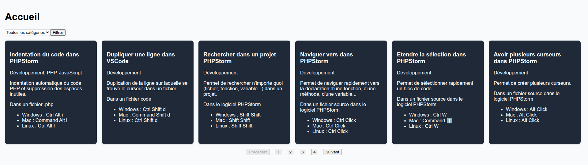

# React Shortcuts

## TODO

- [ ] (6 pts) Afficher un formulaire avec une liste déroulantes des catégories de l'API.
- [ ] (6 pts) Lorsque l'utilisateur sélectionne une catégorie puis clique sur le bouton "Filtrer" du formulaire, afficher les raccourcis associés (faire un appel API de type GET /shortcuts?categories.id=1). Si l'utilisateur ne sélectionne pas de catégorie, afficher tous les raccourcis.
- [ ] (8 pts) Afficher une pagination avec des boutons "Précédent" et "Suivant" pour naviguer entre les pages de résultats (appel API de type GET /shortcuts?categories.id=1&page=2). Si l'utilisateur est sur la première page, désactiver le bouton "Précédent". Si l'utilisateur est sur la dernière page, désactiver le bouton "Suivant".
- [ ] BONUS (2 pts) : Ajouter des numéros de page cliquables entre les flèches "Précédent" et "Suivant" pour permettre à l'utilisateur de naviguer directement vers une page spécifique.

Voici un exemple du résultat attendu :

**Remarques**

La note prendra en compte la qualité du code, l'ergonomie de l'interface et le respect des consignes.
Pensez à bien organiser votre code en composants réutilisables (surtout pour la pagination).

Le composant ShortcutList utilisait Suspense mais j'ai préféré le retirer pour simplifier l'exercice.

L'API retourne maintenant 6 éléments par pages. Il est cependant possible de désactiver la pagination en ajoutant un paramètre ?pagination=false dans l'URL (utile lorsque l'on récupère la liste des catégories ou des logiciels).
